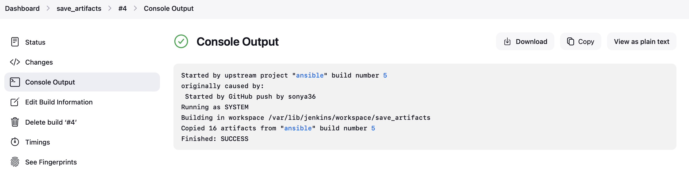

### Ansible Refactoring & Static Assignments (Imports and Roles) 

This project focuses on enhancing the existing Jenkins and Ansible setups by refining the structure, increasing scalability, and introducing efficient deployment practices. The goal is to integrate advanced DevOps practices to make the processes more streamlined and manageable, particularly for large environments. 

---

### **Step 1: Jenkins Job Enhancement**

#### **Initial Setup**

To optimize your Jenkins-Ansible server for handling artifacts:

1. **Create Artifact Storage Directory:**
   Create a directory on your Jenkins-Ansible EC2 instance where build artifacts will be stored.
   ```bash
   sudo mkdir /home/ubuntu/ansible-config-artifact
   ```

2. **Modify Directory Permissions:**
   Grant Jenkins the necessary permissions to store archives in the new directory.
   ```bash
   sudo chmod -R 0777 /home/ubuntu/ansible-config-artifact
   ```

3. **Install Copy Artifacts Plugin:**
   In the Jenkins web interface:
   - Navigate to **Manage Jenkins > Manage Plugins**.
   - Search for the **Copy Artifacts** plugin and install it.

   **Output:** Successful installation of the artifact-saving plugin.
    
---

#### **Creating and Configuring Jenkins Freestyle Project:**

1. **Create a New Freestyle Project:**
   Create a new project called `save_artifacts`.

2. **Link the Project to Trigger on Previous Build:**
   - Go to **Project Configuration > General Tab**.
  
3. **Configure Build Trigger:**
   - Set the **SCM to None**.
   - In the **Build Triggers** section, select **Build after other projects are built**. Input the name of the previous Ansible project (`ansible`).
  

4. **Configure Build Steps:**
   - Select **Copy artifacts from another project**. In the dropdown, choose `ansible`.
   - For **Which build**, select **Latest successful build**.
   - Under **Artifacts to copy**, use `**` to select all artifacts.

   **Output:** Build steps configured to copy artifacts from the Ansible job.
   

5. **Test the Jenkins Job:**
   Make changes to your `README.md` file in the `ansible-config-mgt` GitHub repository to trigger the build.
    
    
    - The error above is from the jenkins console output. This is because jenkins does not have the privillege to write to the ansible-config-artifact directory despite setting permission chmod -R 777 ansible-config-artifact This was resolved by adding jenkins user to ubuntu group (has rwx permission)
        ```
        sudo chown -R ubuntu:jenkins ansible-config-artifact

        sudo usermod -a -G jenkins ubuntu  # Add jenkins user to ubuntu group

        sudo groups ubuntu  # Confirm jenkins user have been added to ubuntu group
        ```
    - I still found a permission denied error. To ensure that the Jenkins user has the necessary permissions to access and write to the /home/ubuntu/ansible-config-artifact directory, I followed these steps:

    - Identify the Jenkins user:

    - The Jenkins user is typically named "jenkins", but you can confirm this by checking the Jenkins configuration or running the following command:
        ```
        ps -ef | grep jenkins
        ```
        ```
        sudo chown -R jenkins:jenkins /home/ubuntu/ansible-config-artifact
        sudo chmod -R 775 /home/ubuntu/ansible-config-artifact
        ```

    - The chmod command sets the permissions to allow the Jenkins user to read, write, and execute files in the directory, and allows the group to read and execute files.

    - Verify the permissions:

    - Run the following command to check the permissions on the directory:
        ```
        ls -l /home/ubuntu
        ```

    - The output should show that the /home/ubuntu/ansible-config-artifact directory is owned by the Jenkins user and group, and the permissions are set to drwxrwxr-x (or similar).

    - Restart Jenkins:

    - After making the permission changes, restart the Jenkins service to ensure the changes take effect:
        ```
        sudo systemctl restart jenkins
        ```
    - I still found more permission error message java.nio.file.AccessDeniedException: /home/ubuntu/ansible-config-artifact.
    - I tried these troubleshooting steps:

    - Verify the directory permissions: Run the following command to check the permissions on the /home/ubuntu directory:
        ```
        ls -ld /home/ubuntu
        ```
    - The output should show that the directory is owned by the ubuntu user and the ubuntu group, with permissions drwxr-xr-x.


    - Grant the Jenkins user access to the parent directory: If the permissions on the /home/ubuntu directory are correct, try granting the Jenkins user access to the parent directory by running:
        ```
        sudo chmod 755 /home/ubuntu
        sudo chown -R ubuntu:jenkins /home/ubuntu
        ```

    - This will allow the Jenkins user to create directories and files within the /home/ubuntu directory.

    - Restart Jenkins:
        ```
        sudo systemctl restart jenkins
        Check the Jenkins user's home directory:
        sudo -u jenkins bash -c 'echo $HOME'
        ```
    - The output should show the Jenkins user's home directory, which should be /var/lib/jenkins by default.

    - If the Jenkins user's home directory is not set correctly, you may need to update the Jenkins configuration to point to the correct home directory.

**Output:** Successful build execution and artifact copying after Ansible build.
    
    
---

### **Step 2: Refactor Ansible Code by Importing Other Playbooks**

#### **Setting Up for Refactoring:**

1. **Pull Latest Code:**
   Ensure you have the latest code from the main branch:
   ```bash
   git pull origin main
   ```

2. **Create and Switch to Refactor Branch:**
   ```
   git checkout -b refactor
   ```

   **Output:** New branch `refactor` created and switched.

---

#### **Reorganize Playbooks:**

1. **Create a `site.yml` File:**
   In the `playbooks` folder, create a `site.yml` file as an entry point for configurations.

2. **Organize Playbooks into Static Assignments:**
   - Create a `static-assignments` folder in the repository root.
   - Move the `common.yml` file into this folder.

3. **Import Playbooks:**
   In `site.yml`, import `common.yml`:
   ```yaml
   ---
   - hosts: all
   - import_playbook: ../static-assignments/common.yml
   ```

   **Output:** Folder structure reorganized, and `site.yml` updated.

---

#### **Run Playbook in Dev Environment:**

1. **Push Changes to GitHub:**
   After reorganizing, push the changes and create a pull request:
   ```bash
   git push origin refactor
   ```

   **Output:** PR created and merged.

2. **Run the Playbook on Dev Environment:**
   SSH into the Jenkins-Ansible server and run the playbook:
   ```bash
   ansible-playbook -i inventory/dev.yml playbooks/site.yml
   ```

   **Output:** Playbook executed successfully.
    

---

#### **Create a Playbook for Wireshark Deletion:**

1. **Create a New Playbook:**
   Create `common-del.yml` under `static-assignments` to delete Wireshark. Add the following code:
   ```yaml
    ---
    - name: Common Configuration
    hosts: all
    remote_user: ec2-user  # or appropriate user for your servers
    become: yes
    become_user: root
    tasks:
        - name: Delete Wireshark on RedHat-based systems
        yum:
            name: wireshark
            state: absent
        when: ansible_os_family == "RedHat"

        - name: Delete Wireshark on Debian-based systems
        apt:
            name: wireshark
            state: absent
        when: ansible_os_family == "Debian"
   ```
    

2. **Update `site.yml`:**
   Modify `site.yml` to import `common-del.yml`.
   ```
   ---
    - import_playbook: ../static-assignments/common-del.yml
   ```

3. **Run the Playbook:**
   SSH into the server and run the updated playbook:
   ```bash
   ansible-playbook -i inventory/dev.yml playbooks/site.yml
   ```

   **Output:** Wireshark deleted on all servers.
    
---

### **Step 3: Configure UAT Webservers with a Role 'Webserver'**

#### **Initial Setup:**

1. **Launch Two EC2 Instances:**
   Spin up two EC2 instances with RHEL 8 for the UAT environment and name them `Web1-UAT` and `Web2-UAT`.

2. **Create the Role:**
   - Create a `webserver` role directory structure:
     ```bash
     mkdir -p roles/webserver/{tasks,defaults,handlers,meta,templates}
     ```


   - Inside `tasks/main.yml`, add the following:
    ```
    ---
    - name: Install Apache
    become: true
    ansible.builtin.yum:
        name: "httpd"
        state: present

    - name: Install Git
    become: true
    ansible.builtin.yum:
        name: "git"
        state: present

    - name: Clone the Tooling repository
    become: true
    ansible.builtin.git:
        repo: https://github.com/sonya36/tooling.git
        dest: /var/www/html
        force: yes

    - name: Copy HTML content to one level up
    become: true
    command: cp -r /var/www/html/html/ /var/www/

    - name: Start the httpd service
    become: true
    ansible.builtin.service:
        name: httpd
        state: started

    - name: Remove /var/www/html/html/ directory
    become: true
    ansible.builtin.file:
        path: /var/www/html/html
        state: absent
    ```
     


#### **Reference Role in Playbooks:**

1. **Update UAT Inventory:**
   Add UAT Web servers in `inventory/uat.ini` with the following format:
   ```yaml
   [uat-webservers]
   <Web1-IP> ansible_ssh_user='ec2-user'
   <Web2-IP> ansible_ssh_user='ec2-user'
   ```

    

2. **Create Playbook for UAT Servers:**
   Create `uat-webservers.yml` under `static-assignments`, referencing the `webserver` role:
   ```yaml
   ---
   - hosts: uat-webservers
     roles:
       - webserver
   ```
      

3. **Update `site.yml`:**
   Add `uat-webservers.yml` to `site.yml`:
   ```yaml
   - import_playbook: ../static-assignments/uat-webservers.yml
   ```
     

---

### **Step 4: Commit & Test**

1. **Push to GitHub:**
   Push the changes and merge them into the main branch.

2. **Run the Playbook:**
   SSH into the Jenkins-Ansible server and run the playbook:
   ```bash
   ansible-playbook -i inventory/uat.yml playbooks/site.yml
   ```
    

   **Output:** UAT web servers successfully configured.

### **Step 6: Access UAT Web Servers**

After the playbook execution, you should verify if the UAT servers are up and running:
1. **Access Web1-UAT:**
- Open your web browser and enter the following URL, replacing <Web1-UAT-Server-Public-IP-or-Public-DNS-Name> with the actual public IP or DNS name of the Web1 UAT server:
```
    http://<Web1-UAT-Server-Public-IP-or-DNS>/index.php
```
 
- **Repeat the process for Web2-UAT:**
```  
    http://<Web2-UAT-Server-Public-IP-or-DNS>/index.php
```
 
---
### **Step 7: Jenkinsbuild Output after merge**
 
 
 
 
 

### **Conclusion:**
In this project, we've refactored our Ansible playbooks and improved our Jenkins job configuration, demonstrating the power of combining automation with scalability for efficient DevOps practices.
